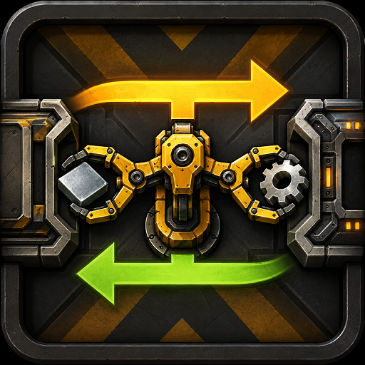
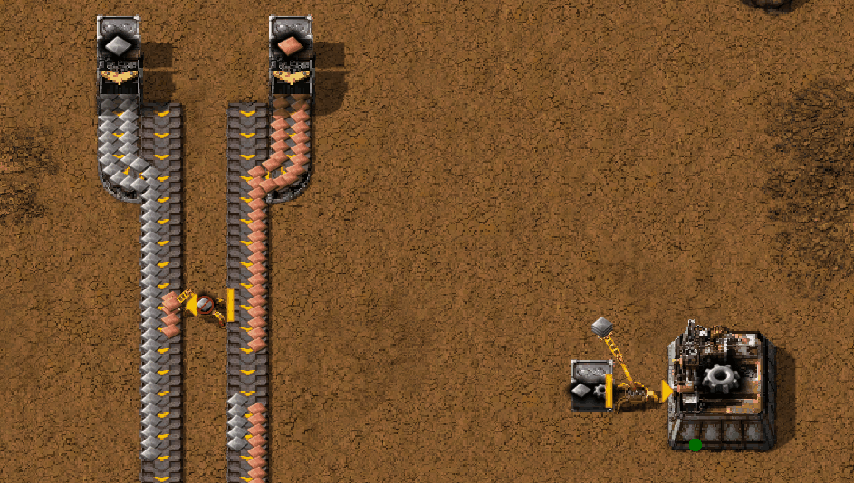
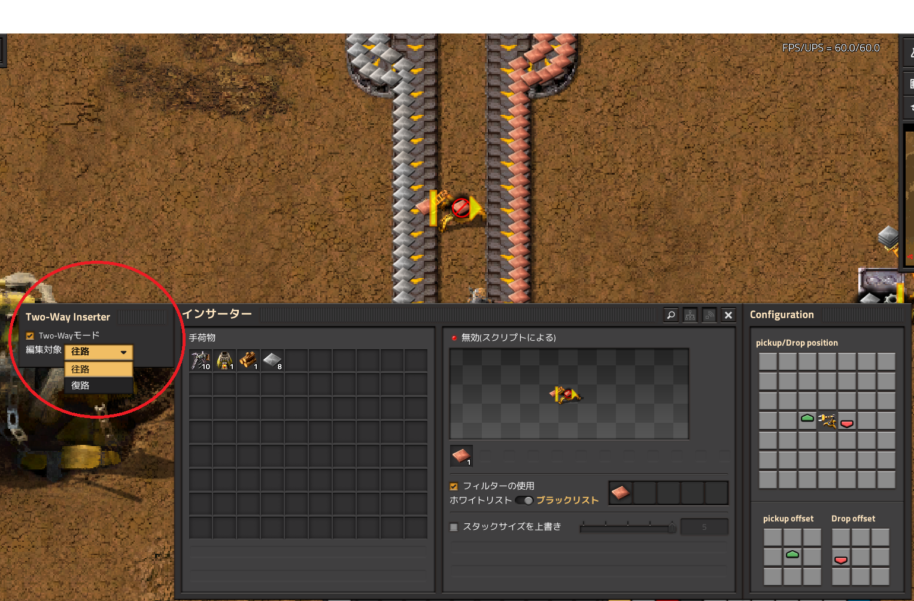

# Two-Way Inserter

<p align="center">
  
</p>

**Two-Way Inserter** is a Factorio 2.0 mod that allows a single inserter to transport items in both directions.

Normally, an inserter carries items in one direction and returns empty.

With Two-Way Inserter enabled, that return trip can be used for another item:

```text
Forward:  A -> B
Reverse:  A <- B
```

The original placement direction remains the **Forward / primary direction**.
Reverse transport is used opportunistically when something useful can be carried back.

No separate inserter item is added — the feature is applied to existing inserters.

---

## How it works

<p align="center">
  
</p>

Suppose a chest supplies iron plates to an assembling machine:

```text
Chest A
   |
   | Iron plates
   v
Inserter
   ^
   | Iron gears
   |
Assembler B
```

A normal inserter can only handle one side of this exchange.

With Two-Way Inserter:

1. The inserter carries iron plates from **A to B**.
2. After dropping them off, it checks whether something can be carried back.
3. If the assembler has an output item available, the inserter carries it from **B to A**.
4. The inserter then returns to its primary Forward direction.

If Forward transport is currently blocked or idle, the inserter also periodically checks whether Reverse transport is possible.

Factorio's normal inserter logic still decides whether an item can actually be picked up or inserted. The mod does not try to reinterpret recipes, machine inventories, ingredients, or products.

---

## Direction-specific settings

Forward and Reverse have separate logical profiles.

For example:

```text
Forward: A -> B
Whitelist: Iron plate

Reverse: B -> A
Blacklist: Iron plate
```

This allows one inserter to feed materials into a machine without immediately carrying those same materials back out.

The following settings can be stored separately for Forward and Reverse:

* Filters
* Filter mode
* Stack size override
* Pickup position
* Drop position

---

## Configuration

<p align="center">
  
</p>

Open an inserter normally.

Two-Way Inserter adds a small configuration panel with:

* **Two-Way mode** — enables or disables bidirectional behavior.
* **Edit: Forward / Reverse** — selects which logical direction you are currently configuring.

The selected profile is applied to the physical inserter, so the normal Factorio inserter GUI can be used to edit its settings.

### Forward

Select **Forward** to edit the inserter's primary direction.

```text
A -> B
```

### Reverse

Select **Reverse** to edit the return direction.

```text
B -> A
```

Filters, stack size, and other supported inserter settings can then be configured using the normal Factorio interface.

When the GUI is closed, the inserter returns to its Forward state and normal Two-Way operation resumes.

---

## Smart Inserters compatibility

[Smart Inserters](https://mods.factorio.com/mod/Smart_Inserters) is supported as an optional compatibility mod.

When Smart Inserters is installed, its normal arm-position controls can be used with the currently selected Two-Way profile.

This means Forward and Reverse can even use different pickup/drop positions.

For example:

```text
Forward:
A outer belt lane -> B inner belt lane

Reverse:
B outer belt lane -> A inner belt lane
```

Two-Way Inserter does not modify or duplicate Smart Inserters' GUI. It simply applies the selected Forward or Reverse profile to the real inserter so Smart Inserters can edit it normally.

Smart Inserters is **optional**. Two-Way Inserter works without it.

---

## Inserter rotation

Rotating a Two-Way Inserter rotates the entire configuration.

Forward remains the primary direction, while the Reverse profile rotates together with it.

If custom Forward and Reverse pickup/drop positions are configured, their relative layout is preserved when the inserter is rotated.

---

## Compatibility

Two-Way Inserter is designed to work with existing entities whose prototype type is `inserter`, including compatible inserters added by other mods.

It does not create separate Two-Way versions of every inserter.

Because modded inserters can implement unusual behavior, compatibility with every custom inserter cannot be guaranteed.

---

## Performance

Only inserters with **Two-Way mode enabled** are tracked by the runtime system.

The mod does not scan every inserter in the world to find potential Two-Way Inserters.

Reverse transport checks are handled internally while preserving the normal Factorio inserter behavior as much as possible.

Performance with very large numbers of Two-Way Inserters is still an area for continued testing and optimization.

---

## Current limitations

### Blueprint persistence

The initial release does **not** provide dedicated blueprint or copy/paste persistence for Two-Way-specific state such as:

* Two-Way mode
* Reverse profile
* Reverse filters
* Reverse stack size
* Independent Reverse pickup/drop positions

Blueprint support may be added later if there is practical demand for it.

Because Two-Way Inserters are generally used for more specialized layouts, this is not currently considered a requirement for the initial release.

---

## Requirements

* Factorio 2.0
* Base game
* Smart Inserters — optional

---

## Feedback and bug reports

If you find a bug, an incompatible inserter, or a situation where Two-Way transport behaves unexpectedly, please open an issue on GitHub.

When reporting compatibility problems, including the name and version of the other mod is especially helpful.

---

## License

MIT License

Copyright (c) 2026 yuna495
